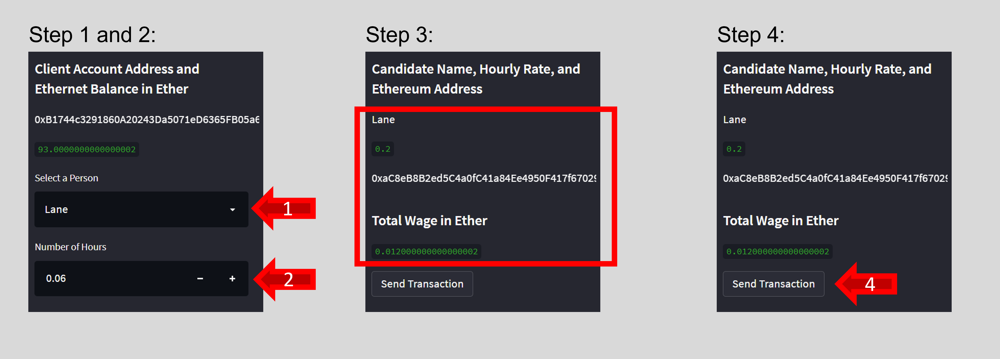

# Fintech Finder Crypto Wallet 👛

- Fintech Finder is an application used to make mock transactions with ficticious fintech professionals. 

- For this app, the wallet details and testnet were originated through [Ganache](https://trufflesuite.com/ganache/), and the user-friendly web interface was built with [Streamlit](https://docs.streamlit.io/library/get-started).

- Source code: [Fintech Finder App](fintech_finder.py)

- Deployed app: 

# Here's How it Works 👇

## Browse Candidates

- Open web application
- Scroll down to view all available candidates

## Make a Transaction

- Choose candidate from the `Select a Person` dropdown menu to the left
- Enter the `Number of Hours`
- Review details for your selected candidate
- Hit the `Send Transaction` button

## Review Transaction Receipt

If your transaction is successfully communicated to Ganache, validated, and added to a block, a resulting transaction receipt will be displayed on the sidebar.

