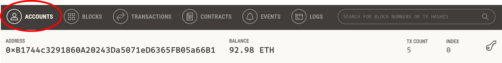

# Fintech Finder Crypto Wallet 💳

- Fintech Finder is an application used to make mock transactions with ficticious fintech professionals. 

- Source code: [Fintech Finder App](fintech_finder.py)

# Here's How it Works 👇

## Browse Candidates

- Open web application
- Scroll down to view all available candidates

## Make a Transaction

- Choose candidate from the `Select a Person` dropdown menu to the left
- Enter the `Number of Hours`
- Review details for your selected candidate
- Hit the `Send Transaction` button

## Review Transaction Receipt

If your transaction is successfully communicated to Ganache, validated, and added to a block, a resulting transaction receipt will be displayed on the sidebar.

# Account and Transaction Record 📜

Check your wallet details on the `Account` tab inside Ganache:

Review your transaction in the `Transactions` tab inside Ganache:

# Useful Links 🆘

- Test your app on an Ethereum blockchain using [Ganache](https://trufflesuite.com/ganache/)

- Build a user-friendly web interface with [Streamlit](https://docs.streamlit.io/library/get-started)
